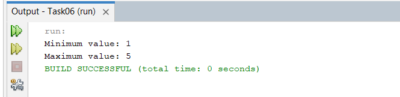

# Zhabko-Denys-34

+ [TASK01](#TASK01)
+ [TASK02](#TASK02)

+ [TASK05](#TASK05)
+ [TASK06](#TASK06)

## TASK01
1. Підготувати сховище до розміщення проекту
2. Написати просту консольну програму (наприклад вивід на екран аргументів командної строки)
3. В особистому кабінеті на сайті gitlab.com отримати адресу доступу до сховища
4. Змінити деректорію проекту та продовжити виконувати його
5. Виконати розробку java проекту в IDE з розміщенням його на сховищі
6. Перевірити код за допомогою модуля "Checkstyle"
7. Прикріпити посилання на GIT та архівований проект

**результат роботи**

## TASK02
**завдання**
1. Розробити клас, що серіалізується, для зберігання параметрів і результатів
обчислень.
Використовуючи агрегування, розробити клас для знаходження рішення
задачі. 
2. Розробити клас для демонстрації в діалоговому режимі збереження та
відновлення стану об'єкта, використовуючи серіалізацію. Показати особливості
використання transient полів. 
3. Розробити клас для тестування коректності результатів обчислень та
серіалізації/десеріалізації.

**результат роботи**

##TASK03
**завдання**
1. Як основа використовувати вихідний текст проекту попередньої лабораторної роботи. Забезпечити розміщення результатів обчислень уколекції з можливістю збереження/відновлення.
2. Використовуючи шаблон проектування Factory Method (Virtual Constructor), розробити ієрархію, що передбачає розширення рахунок додавання
нових відображуваних класів.
3. Розширити ієрархію інтерфейсом "фабрикованих" об'єктів, що представляє набір методів для відображення результатів обчислень.
4. Реалізувати ці методи виведення результатів у текстовому виде.
5. Розробити тареалізувати інтерфейс для "фабрикуючого" методу.

**результат роботи**

## TASK05
**завдання**
1. Реалізувати можливість скасування (undo) операцій (команд).
2. Продемонструвати поняття "макрокоманда"
3.При розробці програми використовувати шаблон Singletone.
4. Забезпечити діалоговий інтерфейс із користувачем.
5.Розробити клас для тестування функціональності програми.

**результат виконання**

## TASK06
**завдання**
1.Продемонструвати можливість паралельної обробки елементів колекції (пошук мінімуму, максимуму, обчислення середнього значення, відбір за критерієм, статистична обробка тощо).
2. Управління чергою завдань (команд) реалізувати за допомогою шаблону Worker Thread.

**результат виконання**

